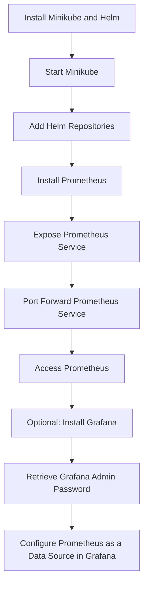

```mermaid
graph TD
    A[Install Minikube and Helm]
    B[Start Minikube]
    C[Add Helm Repositories]
    D[Install Prometheus]
    E[Expose Prometheus Service]
    F[Port Forward Prometheus Service]
    G[Access Prometheus]
    H[Optional: Install Grafana]
    I[Retrieve Grafana Admin Password]
    J[Configure Prometheus as a Data Source in Grafana]

    A --> B
    B --> C
    C --> D
    D --> E
    E --> F
    F --> G
    G --> H
    H --> I
    I --> J
```